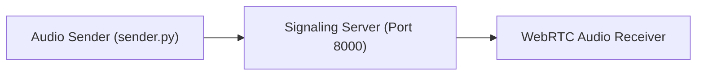
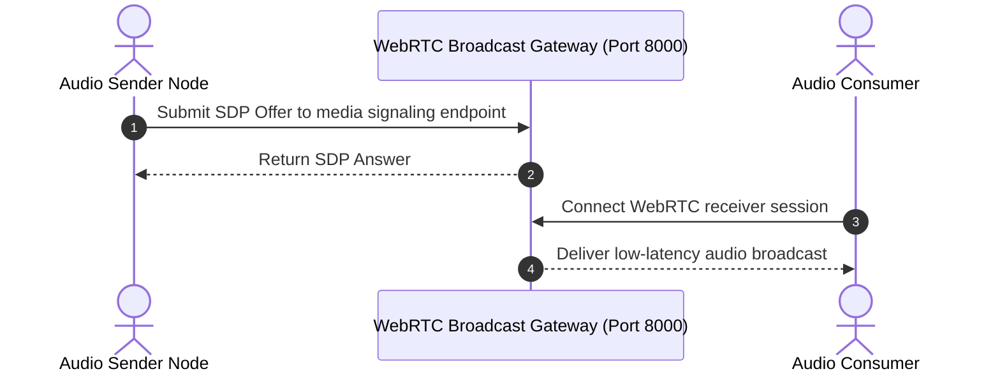

# WebRTC Gateway — Real-Time Streaming & Signaling Node
[]()
[]()
[]()
[]()

## Overview
An optimized streaming gateway and broadcast distribution node implemented in Python using FastAPI, aiortc, and Docker. Configured for low-latency audio/video routing, ICE candidate negotiation, and persistent broadcast sessions.

- **Problem Solved:** Low-latency real-time media relay and broadcast signaling.
- **Target Users:** Real-time communications engineers and broadcast application developers.
- **Current Status:** Functional Signaling Node.

## Features
- **FastAPI Signaling API:** REST endpoints for SDP offer/answer handshakes.
- **Custom Audio Processor:** Modular audio streaming track (`signaling/audio_track.py`).
- **Turnkey Container Packaging:** Ready-to-deploy Dockerfile and Render manifest.

## Architecture


## User Flow


## Technology Stack
| Layer | Technology | Purpose |
|---|---|---|
| Runtime | Python 3.10+ | Asynchronous event loop execution |
| Framework | FastAPI, aiortc | Signaling and WebRTC media handling |
| Container | Docker | Containerized deployment |

## Infrastructure
- **Server Port:** 8000
- **Container:** Dockerfile provided

## Project Structure
```text
WEBRTC_/
├── signaling/
│   ├── audio_track.py       # Audio stream processing
│   ├── requirements.txt     # Python dependencies
│   ├── sender.py            # Audio transmission client
│   └── signaling.py         # FastAPI signaling server
├── Dockerfile               # Docker build definition
├── render.yaml              # Render deployment manifest
├── .gitignore               # Git ignore definitions
└── README.md                # Technical documentation
```

## Prerequisites
- Python >= 3.10
- Docker

## Environment Variables
Copy `.env.example` to `.env` and configure placeholders:
```env
PORT=8000
HOST=0.0.0.0
```

## Local Development Setup
```bash
git clone https://github.com/Bhanutejanallamothu/WEBRTC_.git
cd WEBRTC_/signaling
pip install -r requirements.txt
python signaling.py
```

## Docker Setup
```bash
docker build -t webrtc-gateway .
docker run -p 8000:8000 webrtc-gateway
```

## Database Setup
*Not applicable.*

## API Documentation
- `POST /offer` - Processes WebRTC SDP offer.

## Deployment
Deploy via Docker or Render.

## Security
- Sanitized SDP parsing.
- Restricted CORS configuration.

## Testing
```bash
python signaling/sender.py
```

## Troubleshooting
- Check that UDP ports for WebRTC media streams are not blocked by firewall.

## Future Improvements
- Multi-party conferencing SFU (Selective Forwarding Unit) logic.

## License
All rights reserved by repository owner.
